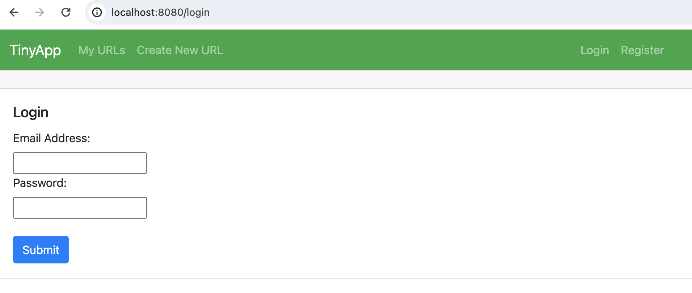

# TinyApp Project

TinyApp is a full stack web application built with Node and Express that allows users to shorten long URLs (à la bit.ly).

## Final Product

## Dependencies

- Node.js
- Express
- EJS
- bcryptjs
- cookie-session

## devDependencies

- chai
- chai-http
- mocha
- nodemon

## Getting Started

- Install all dependencies (using the `npm install` command).
- Run the development web server using the `npm start` command.
- Run mocha and chai tests using the `npm test` command.

- Register and Login to get started.
- Click 'Create New URL' in header or 'Shorten URL' link to create a new url.
- Enter the long URL you would like to shorten, click submit.
- Follow the hyperlink on the assigned short URL to navigate to the external site you have specified.
- If you would like to edit your long url, input a new long url in the edit section.
- To view your added URLS, click 'My URLs' in the header.
- On this page you have the option of editing or deleting the urls in your list.
- A user's short URLs cannot be accessed by other users to view, edit or delete.
- When finished adding and updating urls, you can logout.

